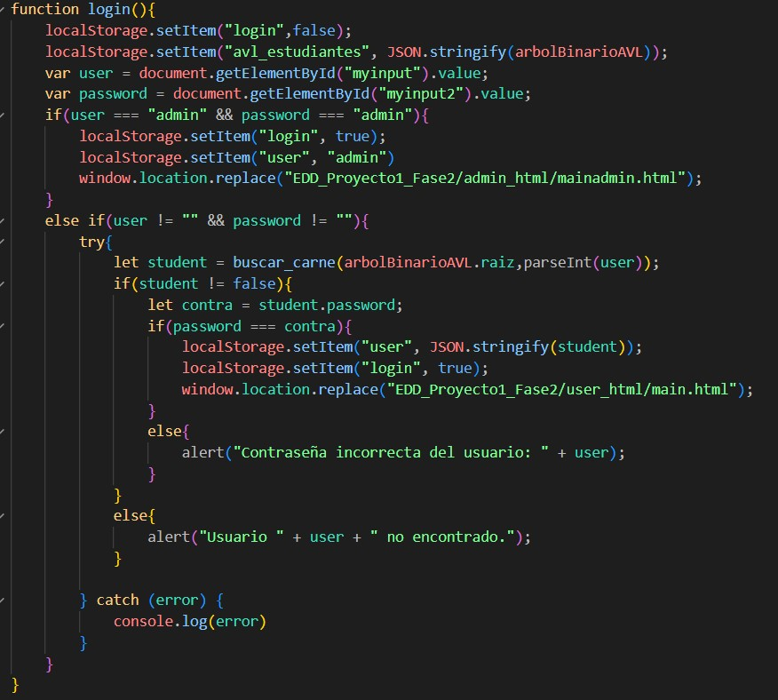
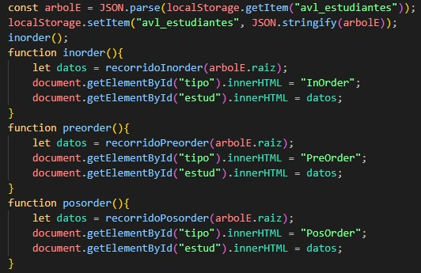
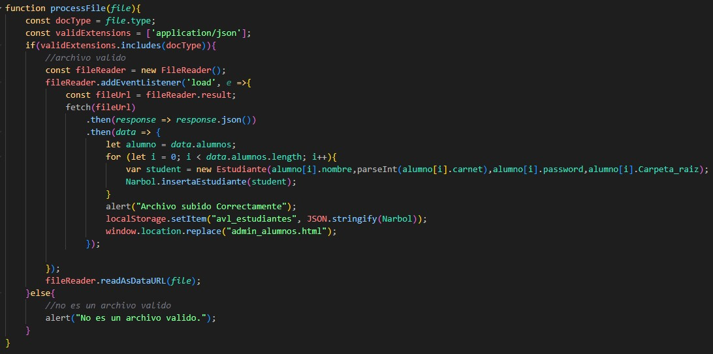
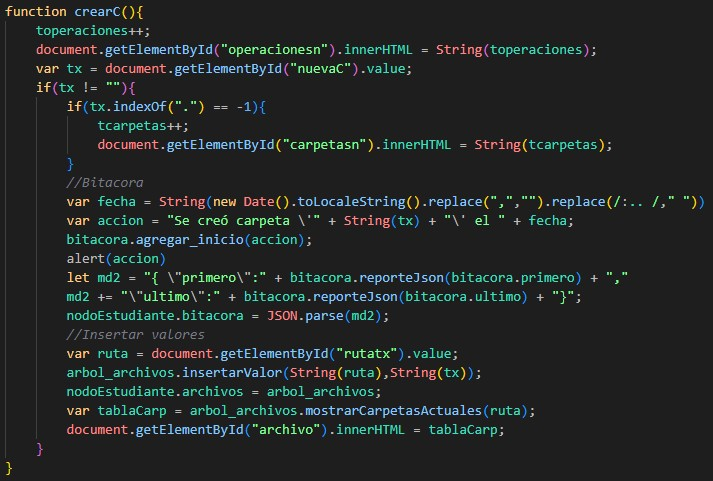
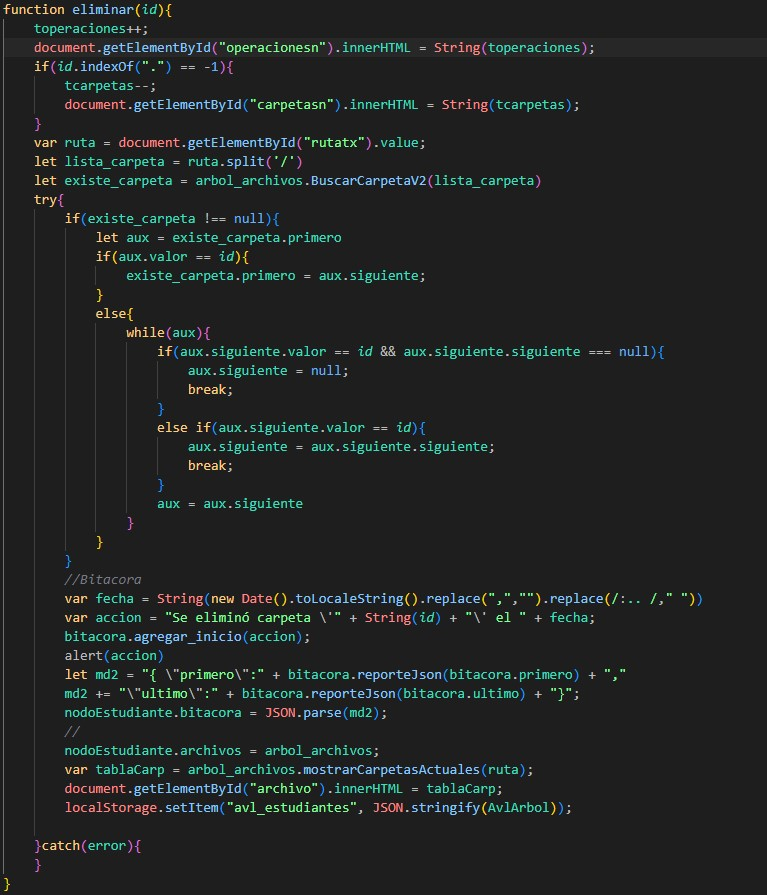
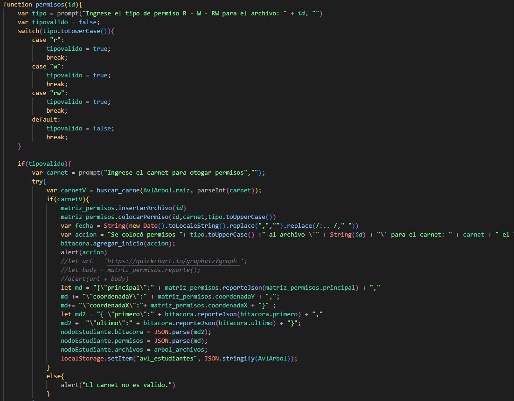
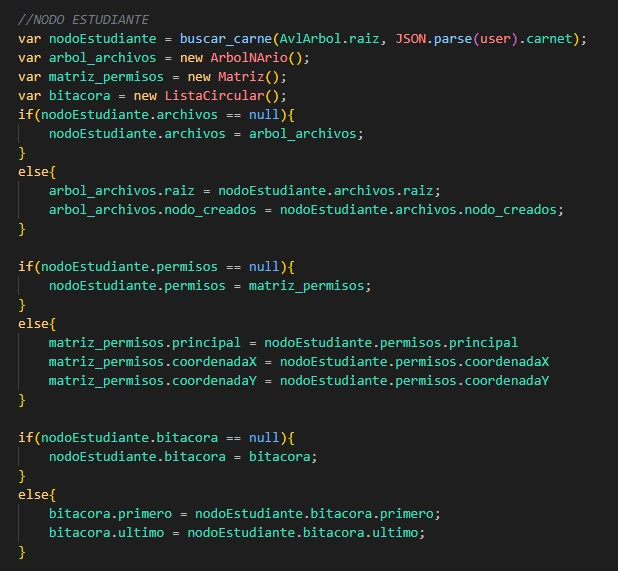
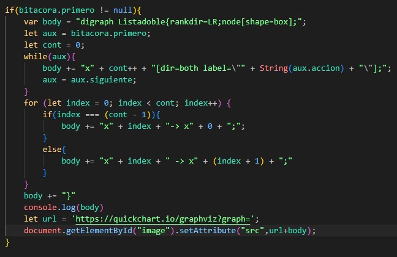

<!--TITULO -->
<h1>MANUAL TECNICO FASE 2 PROYECTO</h1>
Este programa fue desarrollado enteramente en HTML, JavaScript y CSS. Aplicando el paradigma de programación orientada a objetos (POO). Eesto se debe a que se tenía que realizar una aplicación web, que funcionase de manera intuitiva y fácil de usar a cualquier usuario. Todo esto con el fin de poder ayudar al estudiante a organizar sus archivos y poder subirlos en una plataforma para mantenerlos.
<h2>Patrón de diseño</h2>
Debido a la simplicidad de las funciones, se decidió utilizar un patrón de diseño orientado a lo creacional. Especificando de mejor manera, se utilizó un patrón Singleton. Este se refiere a un diseño que restringe la creación de instancias de una clase a un único objeto.
<h2>Metodos principales</h2>
<ul>
  <li>login</li>
  
  <li>Recorridos</li>
  
  <li>Carga Masiva</li>
  
  <li>Crear Carpeta</li>
  
  <li>Eliminar</li>
  
  <li>Permisos</li>
  
  <li>Administrar Local Storage</li>
  
  <li>Bitacora</li>
  
 </ul>