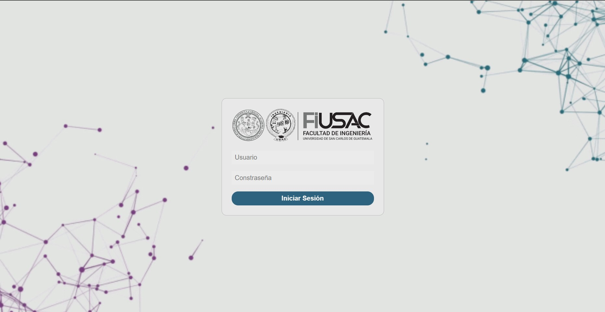

<!--TITULO -->

<h1>MANUAL DE USUARIO FASE 2 PROYECTO</h1>

<h2>Propósito</h2>

Este es un manual de usuario con el fin de resolver u orientar sobre cualquier duda que surja sobre el uso del programa en cuestión. Debido a que contine funciones que pueden parecer sin sentido, sin embargo, todo lo que aparece en las ventanas está estrictamente realizado y validado con infinidad de casos. Por lo cual, el programa puede fallar en pocas o nulas ocasiones.

<h2>Alcance</h2>

Este programa está diseñado para simular un sistema de universidad, en el cual un administrador maneja todos los usuarios en el sistema. Los usuarios son estudiantes, los cuales cuenta con un sistema de almacenamiento al estilo drive, en el cual suben sus archivos, y se almacenan en un Arbol. El fin de este programa es darles a los estudiantes un sistema en el cual puedan almacenar información importante.

<h2>Descripción del sistema</h2>

Es un sistema desarrollado principalmente en 3 herramientas. Las interfaces se realizaron en html puro, sin ninguna plantilla prediseñada. Lo que le da un diseño amigable es el CSS. Todo el backend fue desarrollado en JavaScript.

<h2>Características principales</h2>
<ul>
<li>Leer archivos JSON para la carga de usuarios</li>
<li>Crear y eliminar carpetas</li>
<li>Subir y eliminar archivos de tipo:
    <ul>
        <li>Imagen
            <ul>
                <li>png</li>
                <li>jpg</li>
                <li>jpeg</li>
                <li>gif</li>
            </ul>    
        </li>
        <li> Documento
            <ul>
                <li>PDF</li>
                <li>texto</li>
            </ul>
        </li>
    </ul>
</li>
<li>Generar reportes realizado en Graphviz</li>
<li>Crear permisos para los archivos</li>
</ul>

<h2>Pantallas principales</h2>
<h3>Administrador</h3>
<ul>
    <li>Login:</li>
        
    <li>Admin Dashboard
        <ul>
            <li>Pagina Alumnos:</li>
            
 En esta página se observan los datos de todos los alumnos cargados en el sistema. Tambien se puede ordenar como: preorder, inorder y postorder. Lo cual se observa en tablas generadas en html

            
            <li>Pagina Arboles:</li>
            
 En esta página se observan tres botones, los cuales generan un reporte en Graphviz, creando tablas ordenadas de árbol principal según se desee.

            
            <li>Página Carga Masiva:</li>
            
 En esta página se muestra un área para desplegar archivos donde se puede arrastrar el archivos que se desea cargar al sistema. Se puede realizar lo mismo con el botón seleccionar archivo. Tomar en cuenta que solo acepta archivos .json

            
            <li>Pagina Reporte:</li>
            
 En esta página se muestra el reporte generado en Graphviz de los alumnos que se encuentran en el sistema

            
        </ul>
    </li>
</ul>
<h3>Administrador</h3>
<ul>
    <li>Pagina inicial</li>
    
En esta pagina se observan las funciones del usuario, las cuales son subir archivos y mostrar sus permisos. En el buscador se introduce la ruta y en el panel izquierdo se suben los archivos para que se muestren en la tabla. Cada nodo tiene la opción para crearse, eliminarse y si es un archivo se puede crear permisos de él

    
    <li>Bitácora</li>
    
Se muestran las acciones que realiza el usuario

    
    <li>Reportes</li>
    
Se muestran los dos reportes de Biblioteca y de Permisos. La biblioteca muestra todas las carpetas y archivos, y en permisos se muestran unicamente los archivos que tienen permisos activos.

    
    
</ul>
